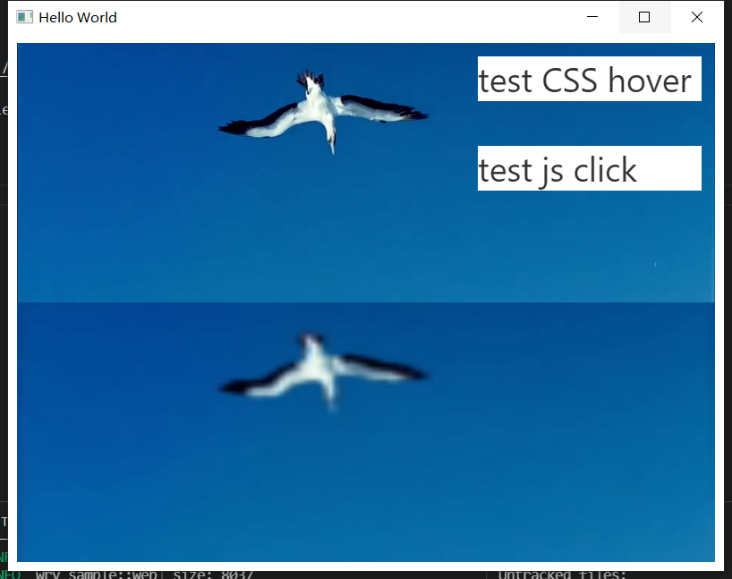
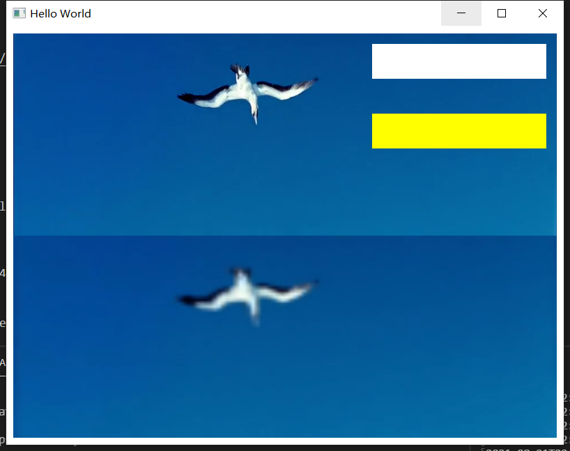
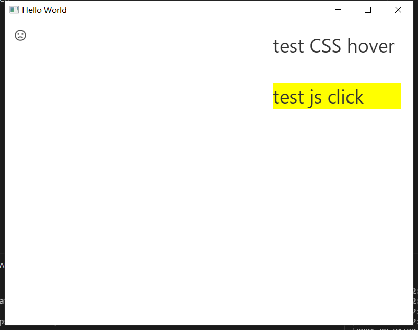
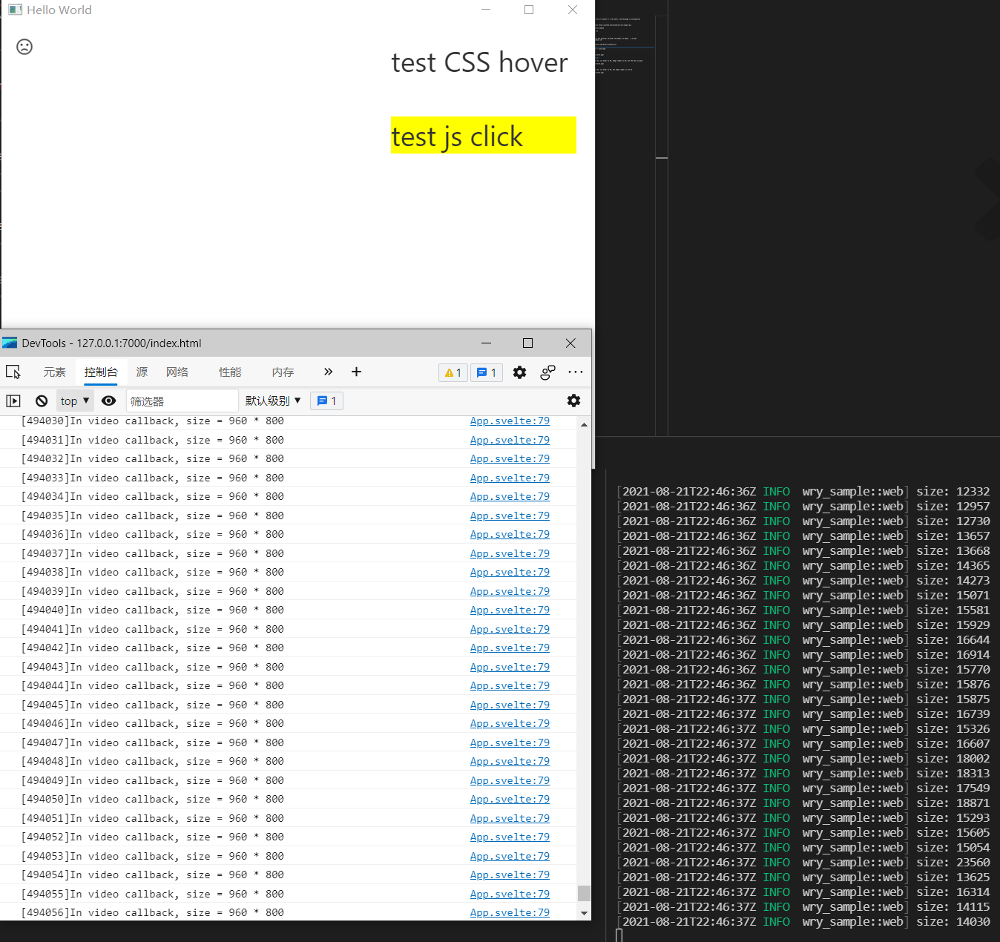

## issue

    After tens of minutes or a few hours, something is unresponsive

### run 

    git clone https://github.com/imxood/wry-yuv-sample.git

    cd wry-yuv-sample

    cargo run

## run env

    host:
        11th Gen Intel(R) Core(TM) i5-1135G7 @ 2.40GHz   2.42 GHz
        windows 10

    rust:
        nightly-x86_64-pc-windows-msvc
        rustc 1.56.0-nightly (0035d9dce 2021-08-16)

    frame:
        wry + actix-web + svelte

    MicrosoftEdgeWebView2RuntimeInstallerX64.exe is lastest

### normal:

### not normal:

1. rust is ok, js event is Ok, css hover is Ok, webgl render is Ok, but the text is gone

or:

2. rust is ok, js event is Ok, css hover is Ok, but webgl render is not Ok

